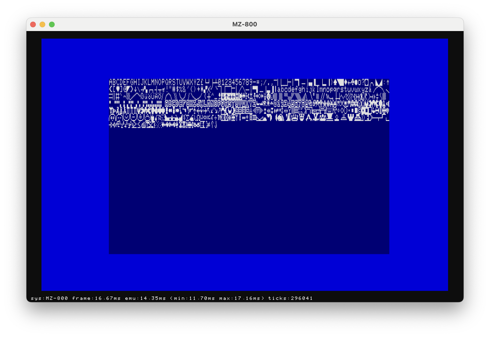

# mz800-emuz

SHARP MZ-800 Emulator using Andre Weissflog's https://github.com/floooh/chipz emulator infrastructure written in zig (https://ziglang.org).

**NOTE:** This project is work in progress, so don't expect anything very useful yet. It doesn't even boot into the monitor. However certain test programs can run successfully. A couple of them are included in the project.

You can drop MZF files onto the emulator window to load and run them.

Build and run (tested with zig 0.14.0-dev.3348+8683f25d2):

```bash
zig build run
```

