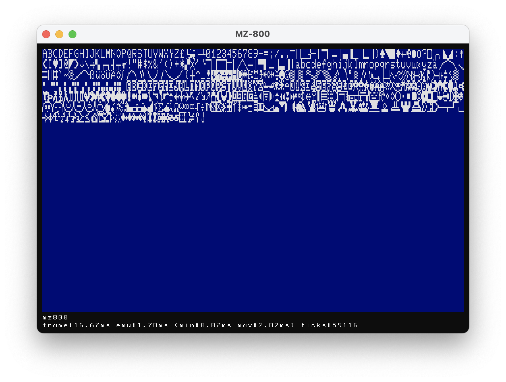
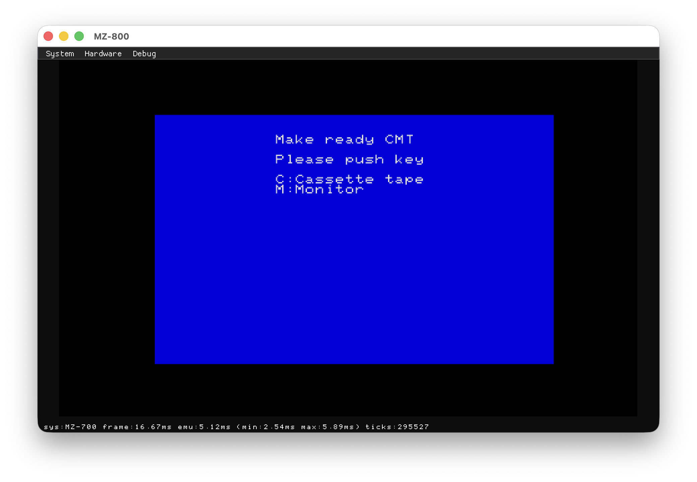

# mz800-emuz

**SHARP MZ-800 Emulator** using Andre Weissflog's https://github.com/floooh/chipz emulator infrastructure written in Zig (https://ziglang.org).



**NOTE:** This project is work in progress. While it does successfully boot into the ROM monitor there are still bugs and unimplemented features. E.g. loading **SHARP BASIC 1Z-016** doesn't work currently.

## Loading MZF files

You can drop MZF files onto the emulator window to load and run them. This automatically reboots the emulator before loading.

## Loading WAV files

You can also load WAV files through the original CMT loading routines of the monitor. Just start the loading either from the IPL or the monitor and then drop the WAV file onto the emulator window. This takes exactly the same time as on the original hardware.

## Run the emulator

Build and run (tested with `zig 0.16.0-dev.2915+065c6e794`):

```bash
zig build --release=fast run
```
